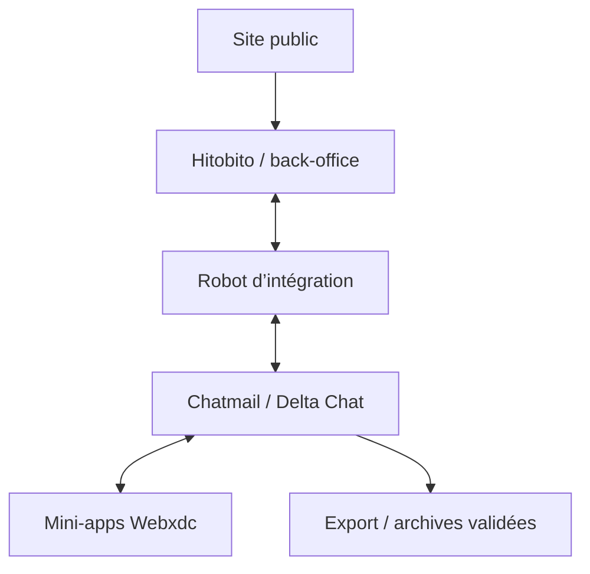

# Architecture

## Principe directeur

Chaque donnée doit être conservée dans la brique la plus adaptée à sa durée de vie et à sa valeur juridique.

| Brique | Responsabilité |
|---|---|
| Hitobito / back-office | Membres, rôles, cotisations, événements officiels, données administratives |
| Chatmail / Delta Chat | Messages, groupes, canaux, fichiers échangés et notifications |
| Webxdc | État collaboratif d’un petit outil partagé dans une conversation |
| Robot Chatmail | Rappels, alertes et synchronisations explicites avec un service externe |
| Site public | Présentation, dons, inscriptions externes et contenus publics |
| Stockage documentaire | Archives, statuts, procès-verbaux validés et pièces durables |

## Schéma fonctionnel

## Flux type : rappel d’événement

1. Hitobito contient l’événement officiel.
2. Le robot détecte une échéance.
3. Le robot publie le rappel dans le groupe concerné.
4. Une mini-app Webxdc recueille disponibilités ou répartition des rôles.
5. Le résultat utile est exporté ou, si nécessaire, retransmis au back-office.

## Contraintes

- Une mini-app Webxdc ne doit pas dépendre d’un accès direct à Internet.
- Un robot est un participant technique : il peut accéder au contenu qui lui est adressé.
- Le relais Chatmail transporte les messages de manière éphémère ; il ne remplace pas une politique d’archivage.
- Les fonctionnalités essentielles doivent rester compréhensibles sans jargon technique.
