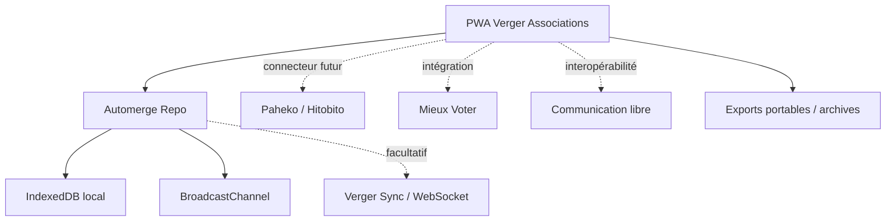

# Architecture

> **Historique :** l’architecture Delta Chat / Webxdc décrite dans les premières versions a servi au prototype v0.2. Depuis le pivot v0.3, l’architecture cible est la PWA local-first décrite dans [`ARCHITECTURE-V03.md`](ARCHITECTURE-V03.md).

## Architecture cible

```mermaid
flowchart TD
    U["PWA Verger Associations"] --> L["Automerge Repo"]
    L --> I["IndexedDB local"]
    L --> B["BroadcastChannel"]
    L -. facultatif .-> S["Verger Sync / WebSocket"]
    U -. connecteur futur .-> P["Paheko / Hitobito"]
    U -. intégration .-> M["Mieux Voter"]
    U -. interopérabilité .-> C["Communication libre"]
    U --> E["Exports portables / archives"]
```

## Principe directeur

Le produit doit continuer à fonctionner sans disponibilité permanente du serveur. Les services externes enrichissent Verger mais ne conditionnent pas ses fonctions métier principales.

## Héritage du prototype

Le prototype Webxdc reste présent dans `apps/reunions-decisions` jusqu’à parité fonctionnelle. Il ne doit pas devenir un second produit maintenu en parallèle.
